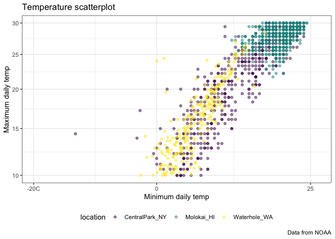

Data Visualization 2
================
2025-10-05

Import the weather dataset

``` r
data("weather_df")
```

Let’s make our basic scatterplot:

``` r
weather_df |> 
  ggplot(aes(x = tmin, y = tmax)) + 
  geom_point(aes(color = name), alpha = 0.5) + 
  labs(
    x = "Minimum daily temp",
    y = "Maximum daily temp",
    title = "Temperature scatterplot", 
    caption = "Data from NOAA",
    color = "location"
  )
```

    ## Warning: Removed 17 rows containing missing values or values outside the scale range
    ## (`geom_point()`).

<!-- -->

## Scales

``` r
  weather_df |> 
  ggplot(aes(x = tmin, y = tmax)) + 
  geom_point(aes(color = name), alpha = 0.5) + 
  labs(
    x = "Minimum daily temp",
    y = "Maximum daily temp",
    title = "Temperature scatterplot", 
    caption = "Data from NOAA",
    color = "location"
  ) + 
  scale_x_continuous(
    breaks = c(-20, 0, 25),
    labels = c("-20C", "0", "25")
  ) +
  scale_y_continuous(
    trans = "sqrt",
    limits = c(10, 30)
  ) +
  viridis::scale_color_viridis(
    discrete = TRUE
  )
```

    ## Warning in transformation$transform(x): NaNs produced

    ## Warning in scale_y_continuous(trans = "sqrt", limits = c(10, 30)): sqrt
    ## transformation introduced infinite values.

    ## Warning: Removed 843 rows containing missing values or values outside the scale range
    ## (`geom_point()`).

<!-- -->

## Themes

Make my base plot:

``` r
ggpt_temperature = 
  weather_df |> 
  ggplot(aes(x = tmin, y = tmax)) + 
  geom_point(aes(color = name), alpha = 0.5) + 
  labs(
    x = "Minimum daily temp",
    y = "Maximum daily temp",
    title = "Temperature scatterplot", 
    caption = "Data from NOAA",
    color = "location"
  ) + 
  scale_x_continuous(
    breaks = c(-20, 0, 25),
    labels = c("-20C", "0", "25")
  ) +
  scale_y_continuous(
    trans = "sqrt",
    limits = c(10, 30)
  ) +
  viridis::scale_color_viridis(
    discrete = TRUE
  )
```

Update my base plot:

``` r
ggpt_temperature +
  theme_bw() +
  theme(legend.position = "bottom") 
```

    ## Warning in transformation$transform(x): NaNs produced

    ## Warning in scale_y_continuous(trans = "sqrt", limits = c(10, 30)): sqrt
    ## transformation introduced infinite values.

    ## Warning: Removed 843 rows containing missing values or values outside the scale range
    ## (`geom_point()`).

<!-- -->

``` r
# theme_dark()
# theme_minimal()
```

## Adding data in geoms()

``` r
centralpark_df = 
  weather_df |> 
  filter(name == "CentralPark_NY")

molokai_df = 
  weather_df |> 
  filter(name == "Molokai_HI")

ggplot(data = molokai_df, aes(x = date, y = tmax, color = name))+
  geom_point() + 
  geom_line(data = centralpark_df)
```

    ## Warning: Removed 1 row containing missing values or values outside the scale range
    ## (`geom_point()`).

<!-- -->
